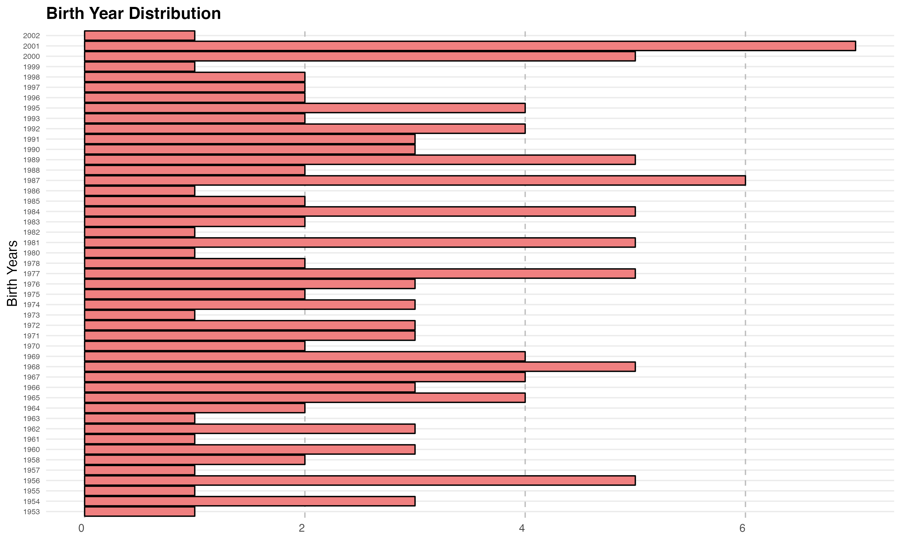

# Findings from the Student Data 
### Major Distribution 

 The "Major Distribution" chart illustrates the distribution of majors in the dataset. Each bar represents a major, and the height of the bar corresponds to the count of students in each major.   
 

### Birth Year Distribution 

 The "Birth Year Distribution" chart displays the distribution of student birth years. It provides insights into the birth year composition of the student population. 

### Total Cost per Major 

 This visualization depicts the distribution of total costs incurred by students across different majors. Stacked bars represent the total cost breakdown for each major and are segregated by payment plan. 

### Balance Due per Major 

 The "Balance Due Distribution" chart showcases the distribution of balance due amounts for students across majors. The chart includes stacked bars representing the balance due amount and are segregated by payment plan..

